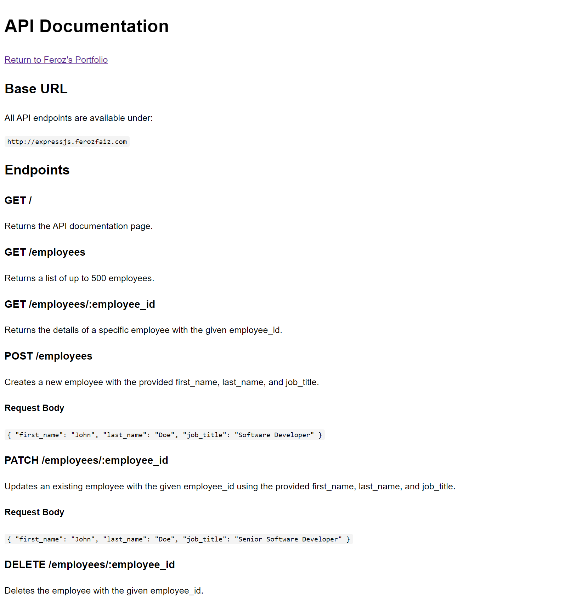

## About the project

This API was built using ExpressJS and utilizes PostgreSQL as its database. It is deployed on a Kubernetes cluster.

**Live Demo**: <a href='https://expressjs.ferozfaiz.com/'>expressjs.ferozfaiz.com</a>

### Tech Stack:

- ExpressJS
- PostgreSQL
- Kubernetes
- Docker
- AWS ECR

## Screenshots

 
<h3 align='center'>Home Page</h3>

