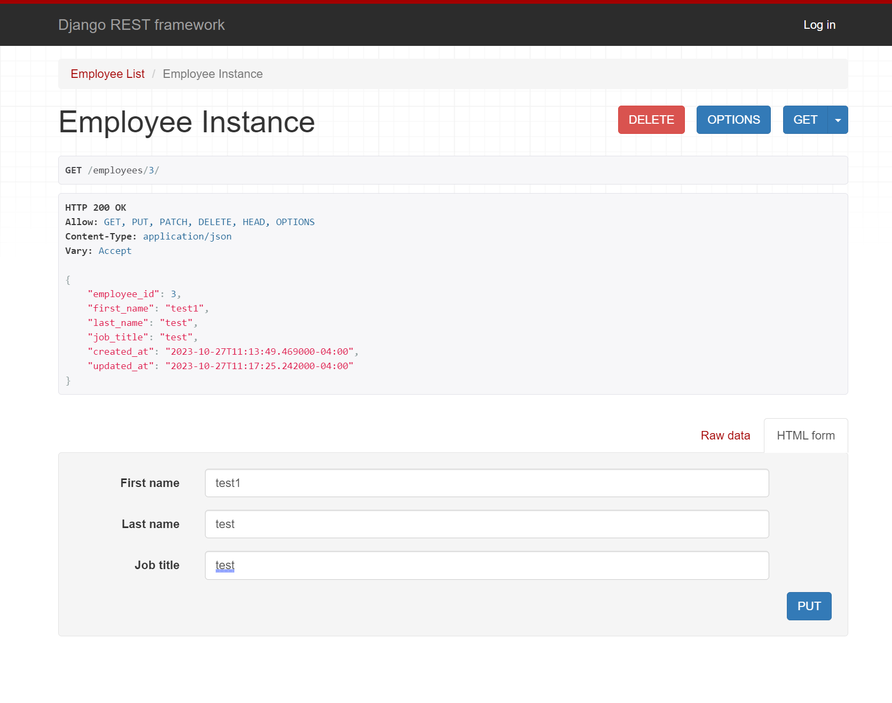

## About the project

This API was built using Django Rest Framework and utilizes PostgreSQL as its database. It is deployed on a Kubernetes cluster.

**Live Demo**: <a href='https://django-rest-framework.ferozfaiz.com/'>django-rest-framework.ferozfaiz.com</a>

### Tech Stack:

- Django Rest Framework
- PostgreSQL
- Kubernetes
- Docker
- AWS ECR

## Screenshots

 
<h3 align='center'>Get Employee</h3>

